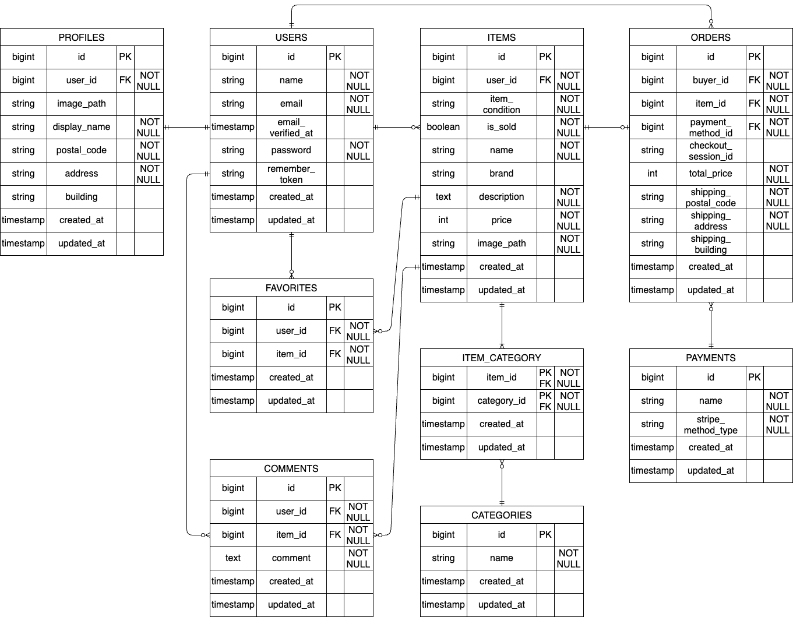

# COACHTECH フリマアプリ

フリマ形式の出品・購入を行う Web アプリケーションです。

## 機能

- ユーザー登録 / ログイン / メール認証
- 商品一覧・検索・商品詳細
- 商品出品（画像アップロード、カテゴリ、状態、価格）
- 商品購入（Stripe Checkout）
- いいね・コメント
- マイページ（購入一覧 / 出品一覧、プロフィール編集）

## 環境構築

### 1. Docker 環境の起動

1. リポジトリを取得して移動する
   1. `git clone https://github.com/nekomajin-1017/exam-frema.git`
   2. `cd exam-frema`
2. Docker Desktop を起動する
3. コンテナを起動する

   `docker compose up -d --build`

### 2. Laravel 環境構築（通常実行用）

1. PHP コンテナへ入る

   `docker compose exec php bash`
2. 依存パッケージをインストールする

   `composer install`
3. 環境変数ファイルを作成する

   `cp .env.example .env`
4. `.env` に以下を追記して保存する

```text
DB_CONNECTION=mysql
DB_HOST=mysql
DB_PORT=3306
DB_DATABASE=laravel_db
DB_USERNAME=laravel_user
DB_PASSWORD=laravel_pass
STRIPE_KEY=pk_test_xxx（取得したキーを入力）
STRIPE_SECRET=sk_test_xxx（取得したキーを入力）
```

5. アプリケーションキーを生成する

   `php artisan key:generate`
6. テーブル作成とダミーデータを投入する

   `php artisan migrate --seed`
7. 画像保存用のシンボリックリンクを作成する

   `php artisan storage:link`

### 3. テスト環境構築

1. `.env.testing` を作成する

   `cp .env.example .env.testing`
2. `.env.testing` に以下を追記して保存する（テスト実行用）

```text
DB_CONNECTION=mysql_test
DB_HOST=mysql
DB_PORT=3306
DB_DATABASE=demo_test
DB_USERNAME=root
DB_PASSWORD=root
STRIPE_KEY=（任意）
STRIPE_SECRET=（任意）
```

3. テスト用データベースを作成する

```bash
docker compose exec mysql bash
mysql -u root -p
CREATE DATABASE demo_test;
exit
```

4. MySQL の入力が完了したら、セッションを終了する
5. PHP コンテナへ再入場してテスト用の初期化を行う

```bash
docker compose exec php bash
php artisan migrate --seed --env=testing
```

## テスト実行

```bash
docker compose exec -T php vendor/bin/phpunit
```

## 使用技術（実行環境）

- PHP: 8.1
- Laravel: 8.x
- MySQL: 8.0.26
- nginx: 1.21.1
- Stripe Checkout
- Laravel Fortify
- Mailhog

## ER 図



## 各種 URL

- アプリ: `http://localhost/`
- ログイン: `http://localhost/login`
- 会員登録: `http://localhost/register`
- phpMyAdmin: `http://localhost:8080/`
- Mailhog（認証メール）: `http://localhost:8025`

## テストユーザー

- 出品者: `seller@example.com` / `Coachtech777`
- 購入者: `buyer@example.com` / `Coachtech777`

初回ログイン時は「認証メールを再送する」ボタンを押してください。

## 補足

- テストでは `CheckoutService` をモック化しているため、Stripe の API 呼び出しは行われません。  
  そのため `STRIPE_KEY` / `STRIPE_SECRET` の設定は任意です。

- コンビニ決済完了時は、Stripe の仕様上 `localhost` へ自動遷移しません。  
  手動で `localhost` にアクセスしてください。
