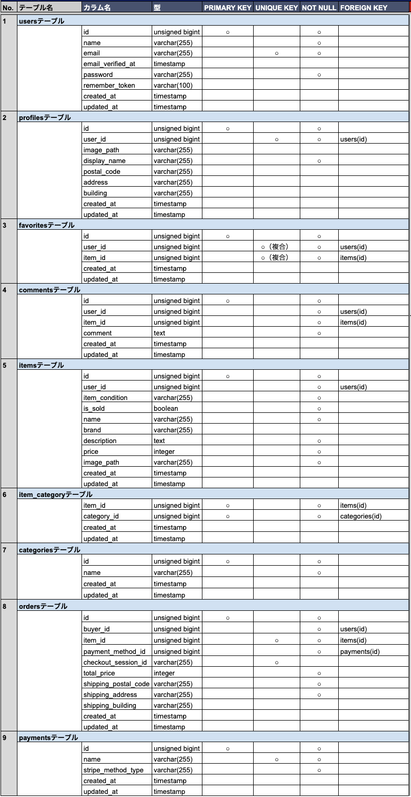

# COACHTECH フリマアプリ

フリマ形式の出品・購入を行う Web アプリケーションです。

## 目次

- [機能](#機能)
- [セットアップ詳細](#セットアップ詳細)
- [テスト実行](#テスト実行)
- [テスト時のDB設定ポリシー](#テスト時のdb設定ポリシー)
- [使用技術（実行環境）](#使用技術実行環境)
- [各種 URL](#各種-url)
- [テストユーザー](#テストユーザー)
- [設計資料](#設計資料)
- [補足](#補足)

## 機能

- ユーザー登録 / ログイン / メール認証
- 商品一覧・検索・商品詳細
- 商品出品（画像アップロード、カテゴリ、状態、価格）
- 商品購入（Stripe Checkout）
- いいね・コメント
- マイページ（購入一覧 / 出品一覧、プロフィール編集）

## セットアップ詳細

### 1. Docker 環境の起動

1. リポジトリを取得して移動する。

```bash
git clone https://github.com/nekomajin-1017/exam-frema.git
cd exam-frema
```

2. Docker Desktop を起動する。
3. コンテナを起動する。

```bash
docker compose up -d --build
```

### 2. Laravel 環境構築（通常実行環境）

1. 依存パッケージをインストールする。

```bash
docker compose exec -T php composer install
```

2. 環境変数ファイルを作成する。

```bash
docker compose exec -T php cp .env.example .env
```

3. `src/.env` に以下を設定する。

```dotenv
DB_CONNECTION=mysql
DB_HOST=mysql
DB_PORT=3306
DB_DATABASE=laravel_db
DB_USERNAME=laravel_user
DB_PASSWORD=laravel_pass
STRIPE_KEY=pk_test_xxx（取得したキーを入力）
STRIPE_SECRET=sk_test_xxx（取得したキーを入力）
```

4. アプリケーションキーを生成する。

```bash
docker compose exec -T php php artisan key:generate
```

5. テーブル作成とダミーデータを投入する。

```bash
docker compose exec -T php php artisan migrate --seed
```

6. 画像保存用のシンボリックリンクを作成する。

```bash
docker compose exec -T php php artisan storage:link
```

### 3. テスト環境構築

1. `.env.testing` を作成する。

```bash
docker compose exec -T php cp .env.example .env.testing
```

2. `src/.env.testing` に以下を設定する。

```dotenv
DB_CONNECTION=mysql_test
DB_HOST=mysql
DB_PORT=3306
DB_DATABASE=demo_test
DB_USERNAME=root
DB_PASSWORD=root
STRIPE_KEY=（任意）
STRIPE_SECRET=（任意）
```

※ テストでは `CheckoutService` をモック化しているため、Stripe の API 呼び出しは行われません。

3. テスト用 APP キーを生成する。

```bash
docker compose exec -T php php artisan key:generate --env=testing
```

4. テスト用データベースを作成する。

```bash
docker compose exec -T mysql mysql -uroot -proot -e "CREATE DATABASE IF NOT EXISTS demo_test;"
```

5. テスト用マイグレーションとシードを実行する。

```bash
docker compose exec -T php php artisan migrate --seed --env=testing
```

6. 必要に応じて設定キャッシュをクリアする。

```bash
docker compose exec -T php php artisan config:clear
```

## テスト実行

```bash
docker compose exec -T php vendor/bin/phpunit
```

## テスト時のDB設定ポリシー

テスト環境の設定値は `src/.env.testing` を正本とし、`src/phpunit.xml` では `APP_ENV` など実行制御のみを定義します。

## 使用技術（実行環境）

- PHP: 8.1
- Laravel: 8.x
- MySQL: 8.0.26
- nginx: 1.21.1
- Stripe Checkout
- Laravel Fortify
- Mailhog

## 各種 URL

- アプリ: `http://localhost/`
- ログイン: `http://localhost/login`
- 会員登録: `http://localhost/register`
- phpMyAdmin: `http://localhost:8080/`
- Mailhog（認証メール）: `http://localhost:8025`

## テストユーザー

- 出品者: `seller@example.com` / `Coachtech777`
- 購入者: `buyer@example.com` / `Coachtech777`

初回ログイン時は「認証メールを再送する」ボタンを押してください。

## 設計資料

### テーブル仕様書



### ER 図


## 補足

- コンビニ決済完了時は、Stripe の仕様上 `localhost` へ自動遷移しません。手動で `http://localhost/` にアクセスしてください。
